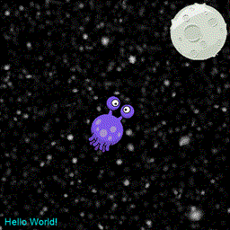
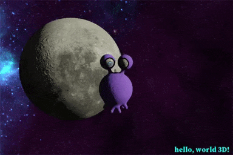

# Jupylet

*Jupylet* is a Python library for programming 2D and 3D games, graphics, music 
and sound synthesizers, interactively in a Jupyter notebook. It is intended 
for three types of audiences:

* Computer scientists, researchers, and students of deep reinforcement learning.
* Musicians interested in sound synthesis and live music coding.
* Kids and their parents interested in learning to program.

&nbsp;

    
    

## Jupylet for Kids

A Jupyter notebook is in essence a laboratory for programming. It is the ideal
environment for playing around with code, experimenting, and exploring ideas.
It is used by professional machine learning scientists who come every day to
play at work, so why not by kids?

*Jupylet* is wonderfully easy to use for creating simple 2D and 3D games and 
music interactively and experimentally. Change a variable or a function and 
see how the game is affected immediately while running.

## Jupylet for Deep Reinforcement Learning

*Jupylet* makes it is super easy to create and modify environments in which to
experiment with deep reinforcement learning algorithms and it includes the API
to programmatically control multiple simultaneous games and render thousands 
of frames per second.

Consider for example the pong game included in this code base. With a few
lines of code you can modify the colors of the game to experiment with transfer 
learning, or turn the game into 4-way pong with agents on all four sides of the 
game court to experiment with cooperation between multiple agents. And since you 
can modify the game interactively in Jupyter this process is not only easy but 
also fun.  

Check out the [*Programming Graphics*](https://jupylet.readthedocs.io/en/latest/programmers_reference_guide/graphics.html) 
and the [*Reinforcement Learning*](https://jupylet.readthedocs.io/en/latest/programmers_reference_guide/rl.html) 
chapters in the Jupylet Programmer's Reference Guide.

## Jupylet for Musicians

*Jupylet* imports ideas and methods from machine learning into the domain
of sound synthesis to easily let you create sound synthesizers as wild as you
can dream up - it includes impulse response reverb effects, colored noise 
generators, resonant filters with cutoff frequency sweeping, oscillators with 
LFO modulation, multi sampled instruments, and much more... And all of it in 
pure Python for you to modify and experiment with.

In addition *Jupylet* draws inspiration from the wonderful [*Sonic Pi*](https://sonic-pi.net/)
and brings live loops and live music coding to Jupyter and Python. Hook up 
your MIDI keyboard and take off.

Check out the [*Programming Sound and Music*](https://jupylet.readthedocs.io/en/latest/programmers_reference_guide/sound.html) 
and the [*Programming Synthesizers*](https://jupylet.readthedocs.io/en/latest/programmers_reference_guide/synthesis.html)
chapters in the Jupylet Programmer's Reference Guide.

## Requirements

_jupylet_ should run on Python 3.6, 3.7, or 3.8 on Windows, Mac, and Linux.

## How to Install and Run Jupylet

If you are new to Python, I recommend that you install and use the
[Miniconda Python](https://docs.conda.io/en/latest/miniconda.html)
distribution. 

On Windows download and run the 64-bit installer for Python 3.8. Once 
Miniconda is installed press the `⊞ Winkey` and then type *Miniconda* and 
press the `Enter` key. This should open a small window that programmers call 
*console* or *shell* in which you can enter commands and run programs.

On Mac OS X download and run "Miniconda3 MacOSX 64-bit pkg" for Python 3.8.
Once installed click the Spotlight icon `🔍` and in the search field type 
*terminal* and press the `Enter` key to open the console.

To run *jupylet* first install it by typing the following command in the
console:

    pip install jupylet

If you are using Python 3.8 on Windows you also need to run following command:

    python -m jupylet postinstall

Next, to run the example notebooks, download the *jupylet* source code. 
If you have [Git](https://git-scm.com/) installed type the following command:

    git clone https://github.com/nir/jupylet.git

Alternatively, you can download the source code with the following command:

    python -m jupylet download

Next, enter the *jupylet/examples/* directory with the change directory
command:

    cd jupylet/examples/

And start a jupyter notebook with:

    jupyter notebook 11-spaceship.ipynb

Run the notebook by following the instructions in the notebook and a game
canvas should appear with the spaceship example:

Alternatively, you can run the same game as a Python script from the console 
with:

    python spaceship.py

## Documentation

To get started with Jupylet head over to the *Jupylet Programmer's Reference 
Guide* which you can find at 
[jupylet.readthedocs.io](https://jupylet.readthedocs.io/).  

To complement the online guide check out the growing collection of 
[*example notebooks*](examples/) that you can download and run on your 
computer as explained above.

## Contact

For questions and feedback send an email to [Nir Aides](mailto:nir@winpdb.org) or [join the discussion](https://github.com/nir/jupylet/discussions).

## Spread the Word

Jupylet is a new library and you can help it grow with a few clicks - 
if you like it let your friends know about it!

## Acknowledgements

* [Einar Forselv](https://github.com/einarf) - The programmer behind ModernGL 
for his endless help in the trenches of OpenGL programming.
* [Alban Fichet](https://afichet.github.io/) - For kindly licensing his 
sound visualizer Shadertoy as CC BY 4.0 license.

## What's New in Version 0.8.6

* Support for rendering Shadertoy OpenGL shaders. 
[Shadertoy](https://www.shadertoy.com/) is an awesome online platform for  
programming and sharing OpenGL shaders online, and now you can 
[use and render shadertoy shaders in Jupylet!](https://jupylet.readthedocs.io/en/latest/programmers_reference_guide/graphics-3d.html#shadertoys)

