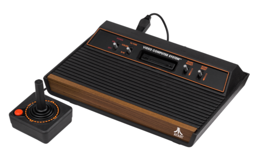
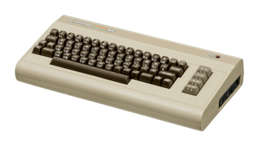

APPENDICES
==========

A Few Words About Notebooks
---------------------------

A Jupyter notebook lets you mix formatted text with computer code and graphics.
Jupyter notebooks belong to the more general category of `computational
notebooks <https://en.wikipedia.org/wiki/Notebook_interface>`_.

Computational notebooks are the modern version of the traditional scientist's
laboratory notebook. Such notebooks have been used by scientists for hundreds
of years to keep track of their ideas and experiments in physics, chemistry,
biology, etc...

A very interesting thing about Jupyter notebooks is that when it comes to
computer science and data science they mix the laboratory and the notebook into
one. That is, a Jupyter notebook is also a computing laboratory since you can
actually run code in them!

Here is a very special example of a traditional laboratory notebook. A page
from `Galileo Galilei's <https://en.wikipedia.org/wiki/Galileo_Galilei>`_
notebook in which he documented his first observations of the moons of Jupiter
400 years ago:

.. image:: https://upload.wikimedia.org/wikipedia/commons/thumb/a/a6/Galileo_manuscript.png/419px-Galileo_manuscript.png

You can think of it as the first Jupiter notebook 😎 and if you know Italian
let me know what it says.

The Atari 2600
--------------

I grew up playing an `Atari 2600 <https://en.wikipedia.org/wiki/Atari_2600>`_ 
like the one shown in this picture:

I spent endless hours of fun playing so many of its games. 

In 2013 Deepmind published a `Reinforcement Learning` algorithm that surpassed 
human level performance on some of its games. The video of their agent 
learning to play and then master the game of `Breakout <https://en.wikipedia.org/wiki/Breakout_(video_game)>`_
stunned the world:

.. raw:: html
    
    <iframe width="560" height="315" src="https://www.youtube.com/embed/TmPfTpjtdgg" frameborder="0" allow="accelerometer; autoplay; clipboard-write; encrypted-media; gyroscope; picture-in-picture" allowfullscreen></iframe>
     
     

Since then Atari games are used as a benchmark for `Reinforcement Learning`
algorithms. 

When I started learning `Deep Learning` and `Deep Reinforcement
Learning` I found myself spending too much time trying to customize the 
computer code running the classic `Atari` games, and so it made perfect sense 
to me to spend a whole lot more time, I mean, way more time, programming a 
completely new environment, and so Jupylet came to be.

The Commodore 64
----------------

I still remember the day my dad brought home the `Commodore 64 <https://en.wikipedia.org/wiki/Commodore_64>`_ 
and we connected it to the TV set for the first time. It is such a beauty - 
take a look:

Just as with the `Atari 2600` I spent countless hours playing its wonderful
games, which made my parents worry quite a bit 😎 but like many other kids I 
soon tried to program it, and then to program basic games with graphics and
sound, and soon I got carried away down the rabbit hole of computation into 
programming wonderland. 

It is a wonder land in which you can turn any idea that pops into your head
into a `something` that works and sounds and plays just like you dreamed it.

The `Commodore 64` was the perfect conductor for that kind of magic. Soon
after I started programming Jupylet I realized that what I really wanted is
to try to recreate this kind of environment for today's kids.

The 6581 SID Chip
-----------------

The `Commodore 64` had a gem of a chip hiding inside it - the 
`6581 SID chip <https://theconversation.com/the-sound-of-sid-35-years-of-chiptunes-influence-on-electronic-music-74935>`_
which was a very sophisticated sound synthesizer for its time:

.. raw:: html

    <iframe width="560" height="315" src="https://www.youtube.com/embed/PRksQbrDprA" frameborder="0" allow="accelerometer; autoplay; clipboard-write; encrypted-media; gyroscope; picture-in-picture" allowfullscreen></iframe>
     
     

As I was programming the sound synthesis framework of Jupylet I revisited the 
epic `Commodore 64 Programmers's Reference Guide <https://archive.org/details/c64-programmer-ref/page/n213/mode/2up>`_ 
and I was stunned to see how advanced it really was. 

It had three independant waveform generators that could generate `sine`, 
`triangle`, `sawtooth`, `pulse` waveform with variable duty, and `white noise`,
and you could use the amplitude of one to modulate the frequency of another! 
It had a classic ADSR envelope generator. It had a filter that you could use 
as `lowpass`, `highpass`, or `bandpass`, and you could sweep its `cutoff` 
frequency dynamically.

And its epic guide explained all of it clearly in a language that a child could
understand and in depth that a musician would find useful and professional 
programmers appreciate, starting with what sound waves really are, 
explaining fundamental frequencies and harmonics, and all the way to describing 
frequency sweeping and how to code the computer to control all of the 
synthesizer's parameters dynamically.

It was recently included in `IEEE Chip Hall of Fame <https://spectrum.ieee.org/tech-history/silicon-revolution/chip-hall-of-fame-mos-technology-6581>`_
and nearly 40 years later it still has a following of fans.

