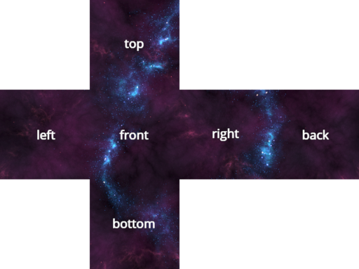

PROGRAMMING 3D GRAPHICS
=======================

Python in Space
---------------

Programming 2D games is awesome, but if you are anything like me what really
blows your mind is 3D graphics; and yes, you can do it in Python!

Nevertheless, programming 3D games can be more demanding than programming 2D 
games. It involves using more complex tools, new concepts like lights and 
cameras, and some understanding of algebra in 3D space.

To help you get started I have created a 3D version of the spaceship game. 
You can find the notebook at `examples/12-spaceship-3d.ipynb <https://github.com/nir/jupylet/blob/master/examples/12-spaceship-3d.ipynb>`_.
Run it and open the magical portal to 3D space: 

.. image:: ../images/spaceship_3d.gif

Blending in 
-----------

In 2D game programming you may use a simple image editor to create game assets. 
The 3D parallel of the 2D image editor is a 3D modelling program. 
3D modelling programs are complex tools and it takes time to master them. The 
great news is that one of the best tools around is completely free.

`Blender <https://www.blender.org/>`_ is a free open source and totally awesome 
3D creation suite, and Jupylet is designed to load assets created with it.

To get started with Blender I recommend the wonderful youtube videos by 
`Grant Abbitt <https://www.youtube.com/c/GrantAbbitt/playlists>`_:

* `Complete Beginners Guide to Blender 2.8 <https://www.youtube.com/watch?v=7MRonzqYJgw&list=PLn3ukorJv4vs_eSJUQPxBRaDS8PrVmIri>`_
* `Beginner Exercises <https://www.youtube.com/watch?v=98FkRIbihyQ&list=PLn3ukorJv4vvv3ZpWJYvV5Tmvo7ISO-NN>`_
* `Sculpting <https://www.youtube.com/watch?v=lKY2FIy60nc&list=PLn3ukorJv4vvJM7tvjet4PP-LVjJx13oB>`_
* `Unwrapping & Placing 2d Textures <https://www.youtube.com/watch?v=bHLT5Xh_tzQ&list=PLn3ukorJv4vve0s-cq8VWS4jRQCdWSU3N>`_

You may recognize the lego bricks in the lego notebook at `examples/13-lego-3d.ipynb <https://github.com/nir/jupylet/blob/master/examples/13-lego-3d.ipynb>`_. 
They were created by following Abbitt's beginner exercises.

**How to export a Blender scene:**

Jupylet can load Blender scenes exported using the glTF 2.0 format. To properly 
export a scene in this format follow these steps:

* Apply scale to all scene objects - to apply scale to an object select it and 
  press ``CTRL+A``.
* Choose export scene as glTF 2.0 format from the `File` menu.
* In the `Format` option select `glTF Separate mode`.
* Select the option to include the `Cameras and Punctual Lights`.
* Select the transform option named `+Y Up`. 
* Select the option to `Apply Modifiers`
* Select the options to include `UVs`, `Normals`, and `Materials`.
* Set the file name and export.

The export should create a `.gltf` file, a `.bin` file, and image files for 
all the textures in the scene.

.. note::
    * At the moment Jupylet does not load animations. 
    * Jupylet can load directional lights, spot lights, and point lights. 
      However, at the moment point lights will only cast shadows in a 90 
      degrees cone. To properly set the cone's direction, temporarily change 
      the point light to spot light, set its direction and then switch it 
      back to point light.

Lights, Camera, Action!
-----------------------

Modern API for 3D graphics are very flexible and may possibly accomodate any  
visual idea you may have regardless of how wild it may be.

However, when many people think of 3D graphics we often imagine being able to 
move around in an environment that is reminiscent of real life in some 
ways; most notably the role played by light and the way it interacts with 
objects in the environment, affecting their color and casting their shadow.

To make this possible, 3D game engines and 3D creation software such as Blender 
employ concepts we are familiar with from real life such as `scenes`, `lights`, 
`cameras`, and `materials`.

When you load an exported Blender scene into Jupylet, it is represented as a
collection of lights, cameras, meshes (i.e. scene objects), and materials.

You can access, introspect, and manipulate these objects, to bring the scene
to life. Let's see how it is done in `examples/12-spaceship-3d.ipynb <https://github.com/nir/jupylet/blob/master/examples/12-spaceship-3d.ipynb>`_.

We start by loading the exported Blender scene:

.. code-block:: python

    from jupylet.loader import load_blender_gltf

    scene = load_blender_gltf('./scenes/moon/alien-moon.gltf')

Shadows are turned off by default. You can turn them on with:

.. code-block:: python

    scene.shadows = True

If you just want to draw the scene, simply call the ``scene.draw()`` 
method in the ``render()`` function. That's it:

.. code-block:: python

    @app.event
    def render(ct, dt):
            
        app.window.clear()
        scene.draw()

The best way to get a grasp on these concepts is to play around with the 
various objects in the scene. Let's modify the camera's `field of view`:

.. code-block:: python

    camera = scene.cameras['Camera']

    camera.yfov = 0.4

If the game is running you should see the camera zoom in. If you
increase the field of view the camera would appear to zoom out.

.. note::
    In Jupyter you can manipulate the properties of objects while the game is
    running and see the effect immediately and interactively.

Let's turn the color of the sun into bright red:

.. code-block:: python

    sun = scene.lights['Light.Sun']

    sun.intensity = 16
    sun.color = 'red'

Let's make the moon twice as big:

.. code-block:: python

    moon = scene.meshes['Moon']

    moon.scale *= 2

Take a few minutes to play around with the objects of the scene and you will 
soon get the idea. After all it's not rocket science.

.. note::
    In Jupyter you can find out the various method and properties of an object
    with the auto `complete function`. e.g. type ``moon.`` (don't forget the 
    dot) and then tap the :guilabel:`Tab` key.

A Little Bit of Math
--------------------

Let's move the alien one unit to the right:

.. code-block:: python

    alien = scene.meshes['Alien']

    alien.position.x += 1

You should be able to notice it moved a little to the right.

.. note::
    We are not specifying coordinates using pixels any more since we are not 
    moving the alien on screen but in 3D space.

Now let's move it one and a half units up:

.. code-block:: python

    alien.position.y += 1.5

So far nothing surprising. Now let's try something new and move it 2 units 
towards us:

.. code-block:: python

    alien.position.z += 2

Coordinates in 3D space have 3 components `x`, `y`, `z`, with the `z` axis 
pointing towards us as shown in this figure:

.. image:: ../images/coordinate_systems_right_handed.png 

More generally the `(x, y, z)` components combined are called a `vector <https://www.khanacademy.org/math/algebra-home/alg-vectors>`_:

.. code-block:: python

    In []: alien.position
    Out[]: vec3( 1, 1.5, 2 )

.. note::
    The ``In []:`` and ``Out []:`` notation in the example above is used in
    Jupyter notebooks to help us distinguish between what we type in and what 
    Python prints out in response.

Jupylet uses a wonderful Python module called `PyGLM <https://github.com/Zuzu-Typ/PyGLM>`_ 
for vector math. It is super fast and very convenient. Check it out!

Let's define an arbitrary displacement in space and use it to move our alien:

.. code-block:: python

    import glm

    displacement = glm.vec3(0.2, 1, 0.33)
    alien.position += displacement

Are you ready for your first 3D animation? Type and run the following code
in the spaceship 3D notebook while the game is running:

.. code-block:: python

    import asyncio

    for i in range(100):
        alien.position += displacement / 30
        await asyncio.sleep(1/30)

If you did it correctly, you should see the alien drift away in the direction 
of the displacement we defined above. 

If you know a little bit of Python you may be wondering why we have used the 
strange looking ``await asyncio.sleep(1/30)`` instead of the standard 
``time.sleep(1/30)``. The simplistic answer is that the `asyncio.sleep` 
function is special in that it tells Python it can go do other stuff until the 
sleep period is over, where other stuff includes important other stuff like 
carrying on with all the other gazillion computations required for keeping the 
game going.

However, while the screen kept updating and the alien kept spinning as it 
drifted away, you may have noticed that the game does not seem to respond 
to key presses while the animation is running and that you therefore cannot 
navigate the spaceship (with the :guilabel:`W`, :guilabel:`A`, and 
:guilabel:`D` keys).

The explanation for why this is happening is complicated and involves advanced
Python, but the good news is that we can easily fix it. Run the following code
in the game notebook and the alien should start drifting indefinitely and 
this time you should be able to chase it by navigating the ship:

.. code-block:: python

    velocity = glm.vec3(0.2, 1, 0.33)

    @app.run_me_every(1/30)
    def drift(ct, dt):
        alien.position += velocity * dt 

Notice how we changed the vector name from `displacement` to `velocity` and now 
we suddenly have `a proper physics equation <https://physics.info/velocity/>`_ 
driving our little animation (ds = v * dt).

Type the following to bring back the alien to its original position:

.. code-block:: python

    alien.position = glm.vec3(0)

Or stop the alien in its tracks with:

.. code-block:: python
    
    app.stop(drift)

Our alien has two interesting vector attributes ``alien.up`` and 
``alien.front``. The `up` vector can be visualized as a personal `+y` axis that 
always points upward through the alien's head regardless of the alien's 
orientation, while the `front` vector always points in the direction the alien
is facing.

The spaceship notebook includes a ``spin()`` function that keeps the alien
spinning clockwise perpetually. Let's combine this spinning with a small 
displacement in the direction of the `up` vector to make the alien swim 
through space in circles:

.. code-block:: python

    @app.run_me_every(1/30)
    def swim(ct, dt):
        alien.position += alien.up * dt 

More generally these personal `up` and `front` vectors are known as the local 
coordinate system of the alien; i.e. a personal set of `+x`, `+y`, `+z` axes 
that rotate along with the alien's orientation.

Here is a version of the ``swim()`` function that uses the local coordinate
system explicitly:

.. code-block:: python

    y_direction = glm.vec3(0, 1, 0)

    @app.run_me_every(1/30)
    def swim(ct, dt):
        alien.move_local(y_direction * dt)

Finally we arrive at the trickiest of all functions - rotation in 3D space. 
The default ``spin()`` function actually performs a clockwise roll rotation; 
that is, a clockwise rotation around the `front` (`+z`) axis. Let's replace 
it with a proper ballet dancing spinning around the `up` (`+y`) axis:

.. code-block:: python

    import math 

    @app.run_me_every(1/30)
    def spin(ct, dt):
        alien.rotate_local(2 * math.pi * dt, y_direction)

The ``alien.rotate_local(angle, axis)`` function expects two arguments; an 
angle specifying how many `radians <https://www.mathopenref.com/radians.html>`_ 
to rotate, and a vector specifying the axis to rotate around.

By multiplying ``2 * math.pi``, the number of radians in a full circle, by 
`dt`, the number of seconds since the last time the function was called, we 
make the alien spin at the rate of one full rotation per second (think about 
it).

The Sky in a Box
----------------

You may be surprised to learn that the beautiful nebula laden sky of the 
spaceship demo is implemented as a box positioned around the game
camera such that the camera is always at the center of the box. 

Each of the six faces of the sky box (its left, front, right, back, top, and
bottom faces) is textured with one of six carefully prepared images of the sky 
as shown in the following illustration:

In the spaceship notebook, the nebula skybox is loaded with the following
statement:

.. code-block:: python

    from jupylet.model import Skybox

    scene.skybox = Skybox('./scenes/moon/nebula/nebula*.png', intensity=2., flip_left_right=True)

The first argument to the Skybox constructor is a `glob path pattern <https://en.wikipedia.org/wiki/Glob_(programming)>`_ 
that matches `the six skybox images <https://github.com/nir/jupylet/tree/master/examples/scenes/moon/nebula>`_. 
The `intensity` argument adjusts the exposure of the images (we brighten them 
a little to make the effect more pleasing). Finally, try toggling the 
`flip_left_right` argument if your skybox appears to be badly stiched 
initially.

Diving into OpenGL
------------------

Over the years many sophisticated algorithms have been developed to enable
computer graphics to reproduce the visual effect of the interaction of light 
and matter. By default Jupylet employs some of these algorithms to approximate
the way Blender would render a 3D scene.

However, you are not limited in any way to the default Jupylet renderer. 
Jupylet is built on top of the wonderful `ModernGL <https://github.com/moderngl/moderngl>`_  
library, which is an efficient wrapper around the `OpenGL API <https://en.wikipedia.org/wiki/OpenGL>`_.

By using ModernGL and the OpenGL API you are free to program GPU shaders to 
create any visual effect you want, from cartoon like shading to mesmerizing 
music visualizations, to any effect you are imaginative enough to dream up
and skilled enough to program.

If you would like to dive into OpenGL and shading check out `learnopengl.com  <https://learnopengl.com/>`_.

