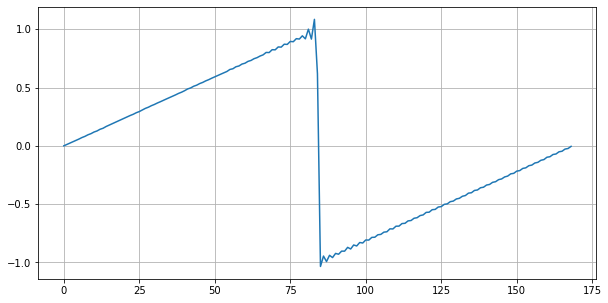
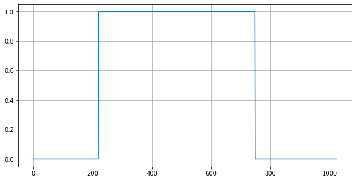
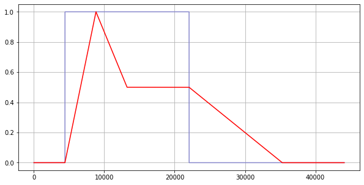

PROGRAMMING SYNTHESIZERS
========================

The Synthesizers Playground
---------------------------

Jupylet includes a flexible and novel sound synthesis framework with which
you can create substractive, additive, frequency modulation, and sample based 
`sound synthesizers <https://en.wikipedia.org/wiki/Software_synthesizer>`_, 
as wild as you can dream up.

It includes the following building blocks, all of which are implemented in 
pure Python and `Numpy <https://numpy.org/>`_, the Python scientific 
computing library, for you to play with:

* Continuous colored noise generators.
* Antialiased wave oscillators with frequency modulation.
* Resonant digital filters with sweepable cutoff frequency.
* Multisampled instruments with frequency modulation.
* ADSR envelopes with linear and non-linear curves.
* Schroeder type algorithmic reverbs.
* Convolution reberb.
* Phase modulator.
* Overdrive.

A sound synthesizer is in essense an audio signal processing graph. Audio 
signals are manipulated and transformed as they travel through the signal 
processing graph from its inputs to its output.

More generally, since each transformation applied to the audio signal is a 
computation, a software sound synthesizer is a computational graph. 

In recent years there has been an explosion of tools and frameworks to 
represent and work with a different kind of computational graph that is 
rapidly growing in popularity and importance - the `artificial neural network <https://en.wikipedia.org/wiki/Artificial_neural_network>`_.

One of the most successful and surely the most Pythonic of them all is the 
wonderful `Pytorch <https://pytorch.org/>`_. Jupylet borrows from Pytorch 
`the natural way in which it represents computational graphs <https://pytorch.org/tutorials/beginner/blitz/neural_networks_tutorial.html#define-the-network>`_. 

Oscillators
-----------

Let's start with a simple sawtooth oscillator:

.. code-block:: python

    osc = Oscillator('saw')

In Jupylet, all audio elements from basic building blocks to compound
synthesizers are ``Sound`` instances, the parallel of a Pytorch ``nn.Module``, 
and similarly you typically apply them to an input to produce output.

Let's ask the oscilator to generate `44100 frames <https://en.wikipedia.org/wiki/44,100_Hz>`_ 
which is the default number of samples per second used by Jupylet and the 
sampling rate most commonly used in recorded audio:

.. code-block:: python

    In []: a0 = osc(frames=44100)
    In []: a0
    Out[]: array([[-0.07100377],
                  [-0.05801778],
                  [-0.04733572],
                  ...,
                  [-0.86131287],
                  [-0.81941793],
                  [-0.83591645]])

These numbers are time series values corresponding to a sawtooth signal. Let's 
visualize them by plotting the first 169 numbers:

.. code-block:: python

    get_plot(a0[:169])
    

The little waves on the sawtooth are actually a good thing. This is how an 
anti-aliased sawtooth wave should look like.

You can play this array to hear how it sounds with:

.. code-block:: python

    sd.play(a0)

.. raw:: html

   <audio controls="controls">
         <source src="../_static/audio/sawtooth.ogg" type="audio/ogg">
         Your browser does not support the <code>audio</code> element.
   </audio>
    
    

In Jupylet you can use an audio signal to modulate the frequency of an 
oscillator; it is called `frequency modulation (FM) <https://en.wikipedia.org/wiki/Frequency_modulation>`_. 
Let's use a 100Hz sine wave to modulate the frequency of a 1000Hz sine wave:

.. code-block:: python

    osc0 = Oscillator('sine', 100)
    osc1 = Oscillator('sine', 1000)

    a0 = osc0() * 12
    a1 = osc1(a0)

Frequency modulation is done in logarithmic scale with semitones as units;
in this case we multiply the modulating signal by 12 so the carrier signal is 
modulated by one octave (12 semitones) up and down. Let's see how the signal 
looks like:

.. code-block:: python

    get_plot(a1)

.. image:: ../images/fm-sawtooth.png 

.. note::
    The units on the `x` axis are frames or samples; therefore, at a sampling 
    rate of 44100Hz the 1024 samples shown in the plot correspond to 
    approximately 23ms.

A Simple Synthesizer
--------------------

We can now take these two oscillators and write our first simple FM 
synthesizer:

.. code-block:: python

    class SimpleFMSynth(Sound):
        
        def __init__(self):
            
            super().__init__()
                    
            self.osc0 = Oscillator('sine', 10)
            self.osc1 = Oscillator('sine')
        
        def forward(self):
            
            a0 = self.osc0() * 12
            a1 = self.osc1(a0, freq=self.freq)
            
            return a1

Let's instantiate it and play a few notes, and while we're at it, let's also 
learn how to grab a recording of the audio output:

.. code-block:: python

    synth = SimpleFMSynth()

    start_recording()

    synth.play(C6)
    await sleep(1/2)

    synth.play_release()
    await sleep(1/2)

    synth.play(D6)
    await sleep(1/2)

    synth.play_release()
    await sleep(1/2)

    synth.play(E6)
    await sleep(1/2)

    synth.play_release()
    await sleep(1/2)

    a0 = stop_recording()
    sf.write('simple-fm-synth.ogg', a0, 44100)

.. raw:: html

   <audio controls="controls">
         <source src="../_static/audio/simple-fm-synth.ogg" type="audio/ogg">
         Your browser does not support the <code>audio</code> element.
   </audio>
    
    

Gates and Envelopes
-------------------

Traditonally, analog synthesizers consist of electronic circuits that generate,
transform, and combine audio signals. Starting in the 70s synthesizers have 
begun using electric signals called 
`control voltage and gates, or CV/gate for short <https://en.wikipedia.org/wiki/CV/gate>`_, 
to control the pitch, onset, and duration of the generated audio signals.

You can visualize a `gate` as an electric voltage that is generated by pressing 
a keyboard key to control the flow of other audio signals (e.g. a sine wave) 
through the circuitry, just as a physical gate would control the flow of people 
in the street.

While these signals are not strictly necessary today they are still sometimes
used in modern equipment, and in particular Jupylet makes use of a gate 
construct to control the precise timing of the onset and duration of sounds.

The concept of a synthesizer `gate` fits elegantly into the conception of 
a synthesizer as a computational graph, as a simple multiplcation operation. 
Let's see one in action:

.. code-block:: python

    gate = LatencyGate()

    gate.open(dt=0.005)
    gate.close(dt=0.012)

    a0 = gate()
    get_plot(a0)

The ``GatedSound`` class uses a ``LatencyGate`` to implement precise onset
and duration of notes. Let's see how to use it to improve our simple 
synthesizer:

.. code-block:: python

    class SimpleFMSynth2(GatedSound):
        
        def __init__(self):
            
            super().__init__()
                    
            self.osc0 = Oscillator('sine', 10)
            self.osc1 = Oscillator('sine')
        
        def forward(self):
            
            g0 = self.gate()
            
            a0 = self.osc0() * 12
            a1 = self.osc1(a0, freq=self.freq)
            
            return a1 * g0

And now we can simplify the code that generates our three little notes to:

.. code-block:: python

    synth = SimpleFMSynth2()

    synth.play(C6, 1/2)
    await sleep(1)

    synth.play(D6, 1/2)
    await sleep(1)

    synth.play(E6, 1/2)
    await sleep(1)

And if we use it in a live loop, notes will be played with precise timing:

.. code-block:: python

    @app.sonic_live_loop
    async def loop0():
        
        use(SimpleFMSynth2())

        play(C6, 1/2)
        await sleep(1)

        play(D6, 1/2)
        await sleep(1)

        play(E6, 1/2)
        await sleep(1)

.. note::
    Remember you can stop the live loop above anytime with ``app.stop(loop0)``.

And now that we've entered the `gate` of sound synthesis, it's 
finally time for the `evnvelope`.

In `sound synthesis, envelopes <https://en.wikipedia.org/wiki/Envelope_(music)>`_ 
control the amplitude of the generated audio signal through time. In the latest 
version of our simple synthesizer the notes start and end abruptly. An envelope 
can let us shape the way in which each note starts and ends.

The Jupylet envelope generator is a traditional four stages envelope generator 
consisting of an `attack` stage specified by the time it takes the envelope to 
reach its peak amplitude, a `decay` stage specified by the time it takes the 
envelope to decay to the `sustain` level of it third stage, and finally a 
`release` stage specified by the time it takes the envelope to decay back to 
zero amplitude once it is released.

.. note::
    The envelope generator was invented by `Robert Moog <https://en.wikipedia.org/wiki/Robert_Moog>`_ 
    the creator of the first commercial synthesizer, the Moog synthesizer, 
    and later the classic `Minimoog synthesizer <https://en.wikipedia.org/wiki/Minimoog>`_
    which was a staple of progressive rock music.

The Jupylet envelope generator expects a `gate` signal in its input to 
control the timing of the `attack` and `release` stages. Let's see an 
example: 

.. code-block:: python

    gate = LatencyGate()
    adsr = Envelope(attack=0.1, decay=0.1, sustain=0.5, release=0.3)

    gate.open(dt=0.1)
    gate.close(dt=0.4)

    g0 = gate(frames=44100)
    e0 = adsr(g0)

Here is a plot of the generated `envelope` signal in red overlayed on top of 
the `gate` signal in light blue. Note how the `gate` signal correponds to 
the `attack` and `release` stages of the `envelope`:

And now that we know how to generate an evelope, let's see how to apply it to 
our simple synthesizer:

.. code-block:: python

    class SimpleFMSynth3(GatedSound):
        
        def __init__(self):
            
            super().__init__()
                    
            self.adsr = Envelope(attack=0.1, decay=0.1, sustain=0.5, release=0.5)
            
            self.osc0 = Oscillator('sine', 10)
            self.osc1 = Oscillator('sine')
        
        def forward(self):
            
            g0 = self.gate()
            e0 = self.adsr(g0)
            
            a0 = self.osc0() * 12
            a1 = self.osc1(a0, freq=self.freq)
            
            return a1 * e0

.. code-block:: python

    synth = SimpleFMSynth3()

    synth.play(C6, 1/2)
    await sleep(1)

    synth.play(D6, 1/2)
    await sleep(1)

    synth.play(E6, 1/2)
    await sleep(1)

.. raw:: html

   <audio controls="controls">
         <source src="../_static/audio/adsr.ogg" type="audio/ogg">
         Your browser does not support the <code>audio</code> element.
   </audio>
    
    

