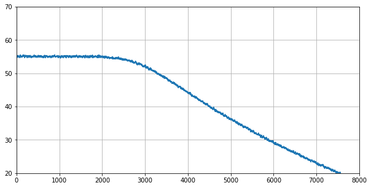
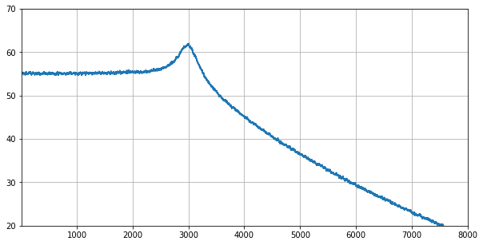

PROGRAMMING SYNTHESIZERS
========================

The Synthesizers Playground
---------------------------

Jupylet includes a flexible and novel sound synthesis framework with which
you can create subtractive, additive, frequency modulation, and sample based 
`sound synthesizers <https://en.wikipedia.org/wiki/Software_synthesizer>`_, 
as wild as you can dream up.

It includes the following building blocks, all of which are implemented in 
pure Python and `Numpy <https://numpy.org/>`_, the Python scientific 
computing library, for you to play with:

* Continuous colored noise generators.
* Antialiased wave oscillators with frequency modulation.
* Resonant digital filters with sweepable cutoff frequency.
* Multisampled instruments with frequency modulation.
* ADSR envelopes with linear and non-linear curves.
* Schroeder type algorithmic reverbs.
* Convolution reberb.
* Phase modulator.
* Overdrive.

A sound synthesizer is in essense an audio signal processing graph. Audio 
signals are manipulated and transformed as they travel through the signal 
processing graph from its input to its output.

More generally, since each transformation applied to the audio signal is a 
computation, a software sound synthesizer is a computational graph. 

In recent years there has been an explosion of tools and frameworks to 
represent and work with a different kind of computational graph that is 
rapidly growing in popularity and importance - the `artificial neural network <https://en.wikipedia.org/wiki/Artificial_neural_network>`_.

One of the most successful and surely the most Pythonic of them all is the 
wonderful `Pytorch <https://pytorch.org/>`_. Jupylet borrows from Pytorch 
`the natural way in which it represents computational graphs <https://pytorch.org/tutorials/beginner/blitz/neural_networks_tutorial.html#define-the-network>`_. 

Oscillators
-----------

Let's start with a simple sawtooth :class:`~jupylet.audio.sound.Oscillator`\:

.. code-block:: python

    osc = Oscillator('sawtooth')

In Jupylet, all audio elements from basic building blocks to compound
synthesizers are :class:`~jupylet.audio.sound.Sound` instances, the parallel 
of a Pytorch ``nn.Module``, and similarly you typically apply them to an input 
to produce an output.

Let's apply the oscilator to generate `44100 frames <https://en.wikipedia.org/wiki/44,100_Hz>`_ 
which is the default number of samples per second used by Jupylet and the 
sampling rate most commonly used in recorded audio:

.. code-block:: python

    In []: a0 = osc(frames=44100)
    In []: a0
    Out[]: array([[-0.07100377],
                  [-0.05801778],
                  [-0.04733572],
                  ...,
                  [-0.86131287],
                  [-0.81941793],
                  [-0.83591645]])

These numbers are time series values corresponding to a sawtooth signal. Let's 
visualize them by plotting the first 169 numbers:

.. code-block:: python

    get_plot(a0[:169])
    
.. image:: ../images/sawtooth.png 

The little waves on the sawtooth are actually a good thing. This is how an 
anti-aliased sawtooth wave should look like.

You can play this array to hear how it sounds with:

.. code-block:: python

    sd.play(a0)

.. raw:: html

   <audio controls="controls">
         <source src="../_static/audio/sawtooth.ogg" type="audio/ogg">
         Your browser does not support the <code>audio</code> element.
   </audio>
    
    

In Jupylet you can use an audio signal to modulate the frequency of an 
oscillator; it is called `frequency modulation (FM) <https://en.wikipedia.org/wiki/Frequency_modulation>`_. 
Let's use a 100Hz sine wave to modulate the frequency of a 1000Hz sine wave:

.. code-block:: python

    osc0 = Oscillator('sine', 100)
    osc1 = Oscillator('sine', 1000)

    a0 = osc0() * 12
    a1 = osc1(a0)

Frequency modulation is done in logarithmic scale with semitones as units;
in this case we multiply the modulating signal by 12 so the carrier signal is 
modulated by one octave (12 semitones) up and down. Let's see how the signal 
looks like:

.. code-block:: python

    get_plot(a1)

.. image:: ../images/fm-sawtooth.png 

.. note::
    The units on the `x` axis are frames or samples; therefore, at a sampling 
    rate of 44100Hz the 1024 samples shown in the plot correspond to 
    approximately 23ms.

A Simple Synthesizer
--------------------

We can now take these two oscillators and write our first simple FM 
synthesizer:

.. code-block:: python

    class SimpleFMSynth(Sound):
        
        def __init__(self):
            
            super().__init__()
                    
            self.osc0 = Oscillator('sine', 10)
            self.osc1 = Oscillator('sine')
        
        def forward(self):
            
            a0 = self.osc0() * 12
            a1 = self.osc1(a0, freq=self.freq)
            
            return a1

Let's instantiate it and play a few notes, and while we're at it, let's also 
learn how to grab a recording of the audio output:

.. code-block:: python

    synth = SimpleFMSynth()

    start_recording()

    synth.play(C6)
    await sleep(1/2)

    synth.play_release()
    await sleep(1/2)

    synth.play(D6)
    await sleep(1/2)

    synth.play_release()
    await sleep(1/2)

    synth.play(E6)
    await sleep(1/2)

    synth.play_release()
    await sleep(1/2)

    a0 = stop_recording()
    sf.write('simple-fm-synth.ogg', a0, 44100)

.. raw:: html

   <audio controls="controls">
         <source src="../_static/audio/simple-fm-synth.ogg" type="audio/ogg">
         Your browser does not support the <code>audio</code> element.
   </audio>
    
    

Gates and Envelopes
-------------------

Traditonally, analog synthesizers consist of electronic circuits that generate,
transform, and combine audio signals. Starting in the 70s synthesizers have 
begun using electric signals called 
`control voltage and gates, or CV/gate for short <https://en.wikipedia.org/wiki/CV/gate>`_, 
to control the pitch, onset, and duration of the generated audio signals.

You can visualize a `gate` as an electric voltage that is generated by pressing 
a keyboard key to control the flow of other audio signals (e.g. a sine wave) 
through the circuitry, just as a physical gate would control the flow of people 
in the street.

While these signals are not strictly necessary today they are still sometimes
used in modern equipment, and in particular Jupylet makes use of a gate 
construct to control the precise timing of the onset and duration of sounds.

The concept of a synthesizer `gate` fits elegantly into the conception of 
a synthesizer as a computational graph, as a simple multiplcation operation. 
Let's see it in action:

.. code-block:: python

    gate = LatencyGate()

    gate.open(dt=0.005)
    gate.close(dt=0.012)

    g0 = gate()
    get_plot(g0)

.. image:: ../images/gate.png 

The :class:`~jupylet.audio.sound.GatedSound` class employs a 
:class:`~jupylet.audio.sound.LatencyGate` to implement precise onset
and duration of notes. Let's see how to use it to improve our simple 
synthesizer:

.. code-block:: python

    class SimpleFMSynth2(GatedSound):
        
        def __init__(self):
            
            super().__init__()
                    
            self.osc0 = Oscillator('sine', 10)
            self.osc1 = Oscillator('sine')
        
        def forward(self):
            
            g0 = self.gate()
            
            a0 = self.osc0() * 12
            a1 = self.osc1(a0, freq=self.freq)
            
            return a1 * g0

And now we can simplify the code that generates our three little notes to:

.. code-block:: python

    synth = SimpleFMSynth2()

    synth.play(C6, 1/2)
    await sleep(1)

    synth.play(D6, 1/2)
    await sleep(1)

    synth.play(E6, 1/2)
    await sleep(1)

And if we use it in a live loop, notes will be played with precise timing:

.. code-block:: python

    @app.sonic_live_loop
    async def loop0():
        
        use(SimpleFMSynth2())

        play(C6, 1/2)
        await sleep(1)

        play(D6, 1/2)
        await sleep(1)

        play(E6, 1/2)
        await sleep(1)

.. note::
    Remember you can stop the live loop above anytime with ``app.stop(loop0)``.

And now that we've entered the `gate` of sound synthesis, it's 
finally time for the `evnvelope`.

In `sound synthesis, envelopes <https://en.wikipedia.org/wiki/Envelope_(music)>`_ 
control the amplitude of the generated audio signal through time. In the latest 
version of our simple synthesizer the notes start and end abruptly. An envelope 
can let us shape the way in which each note starts, progresses, and ends.

The Jupylet envelope generator is a traditional four stages envelope generator 
consisting of an `attack` stage specified by the time it takes the envelope to 
reach its peak amplitude, a `decay` stage specified by the time it takes the 
envelope to decay to the `sustain` level of it third stage, and finally a 
`release` stage specified by the time it takes the envelope to decay back to 
zero amplitude once it is released.

.. note::
    The envelope generator was invented by `Robert Moog <https://en.wikipedia.org/wiki/Robert_Moog>`_ 
    the creator of the first commercial synthesizer, the Moog synthesizer, 
    and later the classic `Minimoog synthesizer <https://en.wikipedia.org/wiki/Minimoog>`_
    which was a staple of progressive rock music.

The Jupylet envelope generator expects a `gate` signal in its input to 
control the timing of the `attack` and `release` stages. Let's see an 
example: 

.. code-block:: python

    gate = LatencyGate()
    adsr = Envelope(attack=0.1, decay=0.1, sustain=0.5, release=0.3)

    gate.open(dt=0.1)
    gate.close(dt=0.4)

    g0 = gate(frames=44100)
    e0 = adsr(g0)

Here is a plot of the generated `envelope` signal in red overlayed on top of 
the `gate` signal in light blue. Note how the `gate` signal correponds to 
the `attack` and `release` stages of the `envelope`:

.. image:: ../images/adsr.png

And now that we know how to generate an evelope, let's see how to apply it to 
our simple synthesizer:

.. code-block:: python

    class SimpleFMSynth3(GatedSound):
        
        def __init__(self):
            
            super().__init__()
                    
            self.adsr = Envelope(attack=0.1, decay=0.1, sustain=0.5, release=0.5)
            
            self.osc0 = Oscillator('sine', 10)
            self.osc1 = Oscillator('sine')
        
        def forward(self):
            
            g0 = self.gate()
            e0 = self.adsr(g0)
            
            a0 = self.osc0() * 12
            a1 = self.osc1(a0, freq=self.freq)
            
            return a1 * e0

.. code-block:: python

    synth = SimpleFMSynth3()

    synth.play(C6, 1/2)
    await sleep(1)

    synth.play(D6, 1/2)
    await sleep(1)

    synth.play(E6, 1/2)
    await sleep(1)

.. raw:: html

   <audio controls="controls">
         <source src="../_static/audio/adsr.ogg" type="audio/ogg">
         Your browser does not support the <code>audio</code> element.
   </audio>
    
    

The Colors of Noise
-------------------

I always thought the term `white noise` was just a figure of speech, a slang. 
I was wrong. It turns out the term `white noise` is so called in analogy to 
`white light` - that is, the signal you would get if you mix together all the 
different sine waves in the world, all equally powerful.

And just as it is with light, `acoustic noise can have colors too <https://en.wikipedia.org/wiki/Colors_of_noise>`_,
ranging from `red` noise where the low frequency waves are more powerful, 
to `pink` noise, to `white` noise where all frequencies have equal power, to
`blue` noise, and finally to `violet` noise the high frequency 
waves are more powerful.

Imagine that we took apart a noise signal back to the separate sine waves 
it is made of and measured how powerful each of the sine waves is. If we did 
that we could then plot the power as a function of frequency, or as it is 
commonly known a `power spectrum <https://mathworld.wolfram.com/PowerSpectrum.html>`_.

Since the power of all the sine waves that make up white noise is equal, the 
`power spectrum` of white noise would look like an horizontal line. Similarly 
the power spectrum of `red` and `pink` noise would look like a downward slope 
and that of `blue` and `violet` noise would look like an upward slope, as 
illustrated in the following figure (from Wikimedia Common):

.. image:: https://upload.wikimedia.org/wikipedia/commons/6/6c/The_Colors_of_Noise.png
    :alt: Copyright Wikimedia Common, Creative Commons (CC BY-SA 3.0)

You can create a noise generator by specifying its color name or a value 
between -6 for `red` noise, and 6 for `violet` noise. Let's create and play 
some `violet` noise:

.. code-block:: python

    noise = Noise('violet')
    sd.play(noise(frames=44100))

.. raw:: html

   <audio controls="controls">
         <source src="../_static/audio/violet.ogg" type="audio/ogg">
         Your browser does not support the <code>audio</code> element.
   </audio>
    
    

Noise generators can be used to create a variety of effects. One interesting
application is to use `red` noise to modulate the frequency of another signal:

.. code-block:: python

    class Wobbly(GatedSound):
        
        def __init__(self):
            
            super().__init__()
                    
            self.adsr = Envelope(attack=0.01, decay=0.5, sustain=0., release=0., linear=False)
            
            self.noise = Noise('red')
            self.osc0 = Oscillator('tri')
            
        def forward(self):
            
            g0 = self.gate()
            e0 = self.adsr(g0)
            
            n0 = self.noise() 
            a0 = self.osc0(n0, freq=self.freq)

            return a0 * e0

    wobbly = Wobbly()

    wobbly.play_poly(C5)
    await sleep(1/4)

    wobbly.play_poly(E5)
    await sleep(1/4)

    wobbly.play_poly(G5)
    await sleep(1/4)

    wobbly.play_poly(B5)
    await sleep(1/4)

    wobbly.play_poly(C6)
    await sleep(1)

.. raw:: html

   <audio controls="controls">
         <source src="../_static/audio/wobbly.ogg" type="audio/ogg">
         Your browser does not support the <code>audio</code> element.
   </audio>
    
    

Filters
-------

The next staple element of sound synthesis up our sleeve is the 
`audio filter <https://en.wikipedia.org/wiki/Audio_filter>`_. Filters are used 
in `subtractive synthesis <https://en.wikipedia.org/wiki/Subtractive_synthesis>`_ 
to attenuate particular frequencies in an audio signal rich in harmonics, 
similar to how your lips attenuate the sound coming out of your mouth as you 
speak or sing.

Jupylet includes a resonant filter parameterized by a `cutoff` frequency, that 
can operate in one of three modes; as a `lowpass` filter that attenuates 
frequencies above the `cutoff` frequency, a `highpass` filter that attenuates
frequencies below the `cutoff` frequency, or a `bandpass` filter that 
attenuates frequencies outside a band of frequencies centered around the 
`cutoff` frequency.

As we saw above, `white` noise is made of sine waves of all frequencies, all 
having equal power. We can therefore apply a filter to white noise to see how 
it attenuates the power of different frequencies; Let's do that with a 
`lowpass` filter and a `cutoff` frequency of `3000Hz`:

.. code:: python

    noise = Noise('white')
    lowpass = ResonantFilter(3000, 'lowpass')

    n0 = noise(frames=44100 * 128)
    a0 = lowpass(n0)

    get_power_spectrum_plot(a0, xlim=(0, 8000), ylim=(20, 70))

What a beauty. Now let's try it again with some resonance at the cutoff 
frequency:

.. code:: python

    noise = Noise('white')
    lowpass = ResonantFilter(3000, 'lowpass', resonance=2)

    n0 = noise(frames=44100 * 128)
    a0 = lowpass(n0)

    get_power_spectrum_plot(a0, xlim=(0, 8000), ylim=(20, 70))

A resonant filter amplifies the frequencies around its cutoff frequency. It 
works similar to the resonance chamber of a guitar in that it is designed to 
amplify particular frequencies. 

You may have wondered about the little waves that were visible in the 
antialiased sawtooth wave that we saw in the beginning of this chapter. They 
were there because a `sawtooth wave <https://en.wikipedia.org/wiki/Sawtooth_wave>`_ 
is actually made of many simple sine waves of different frequencies and power. 

These waves are also called `tones` or `partials`. The preceived pitch of the 
sawtooth wave is determined by the `partial` with the lowest frequency, which 
is called the `fundamental`. In a sawtooth wave, the frequencies of all the 
partials are interger multiples (also called `harmonics`) of the fundamental 
frequency, and their amplitude is inversely proportional to the integer 
multiple. 

You can read more about it in the Wikipedia article on the 
`Harmonic series <https://en.wikipedia.org/wiki/Harmonic_series_(music)>`_.

OK, it's time to put it all together into a synthesizer inspired by the sound 
of the `Roland TB-303 Bass Line <https://en.wikipedia.org/wiki/Roland_TB-303>`_. 
The distinctive sound of the TB-303 is created by sweeping the cutoff 
frequency of a resonant lowpass filter from an initial high cutoff frequency 
down to the frequency of the note being played. To implement the sweep we 
employ a second envelope and configure it to decay nonlinearly from 1 to 0, 
and then we use it to modulate the cutoff frequency of the filter. As usual 
the modulation is done in logarithmic scale with semitones as units.

.. code:: python

    class TB303(GatedSound):
        
        def __init__(self):
            
            super().__init__()
            
            self.shape = 'sawtooth'
            self.resonance = 2
            self.cutoff = 0
            self.decay = 1

            self.env0 = Envelope(0.01, 0., 1., 0.01)
            self.env1 = Envelope(0., 1., 0., 0., linear=False)
            
            self.osc0 = Oscillator('sawtooth')
            
            self.filter = ResonantFilter(btype='lowpass', resonance=2)
            
        def forward(self):
            
            g0 = self.gate()
            
            e0 = self.env0(g0)
            e1 = self.env1(g0, decay=self.decay) * 12 * 8
                    
            a0 = self.osc0(shape=self.shape, freq=self.freq) 
            
            a1 = self.filter(
                a0, 
                key_modulation=e1+self.cutoff, 
                resonance=self.resonance,
                freq=self.freq,
            )
            
            return a1 * e0

.. note::
    We declared the `shape`, `resonance`, `cutoff`, and `decay` variables as 
    members of the synthesizer class since this will enable us to specify 
    their values in calls to the ``use()`` and ``play()`` functions - for 
    example ``play(C4, 1/2, resonance=4, decay=2)``.

And now that the synthesizer is ready let's instantiate it, set up a nice 
reverb effect, and start two simple simultaneous loops:

.. code:: python

    tb303 = TB303()

    set_effects(ConvolutionReverb(impulse.InsidePiano))

    @app.sonic_live_loop2
    async def loop0():

        use(tb303, resonance=8, decay=1, cutoff=12, amp=1)

        play(C3, 1/2)
        await sleep(2)
        
        play(G2, 1/2)
        await sleep(2)
        
        play(Ds3, 1/2)
        await sleep(2)
        
        play(C3, 1/2)
        await sleep(2)
        

    @app.sonic_live_loop2
    async def loop1():
                
        use(tb303, resonance=8, decay=1/8, cutoff=48, amp=1)
        
        play(C2, 1/8)
        await sleep(1/4)
        
        play(C3, 1/8)
        await sleep(1/4)
    
.. raw:: html

   <audio controls="controls" loop>
         <source src="../_static/audio/tb303.5.ogg" type="audio/ogg">
         Your browser does not support the <code>audio</code> element.
   </audio>
    
    

.. note::
    If you update a live loop decorated with :func:`@app.sonic_live_loop2 <jupylet.app.App.sonic_live_loop2>`
    the new code will kick in once the current cycle through the loop 
    completes.

What Next?
----------

Now it's up to you. There are plenty of subjects we did not cover here but
what has been covered should be just enough to get you started like a 
ballistic missile into sound synthesis play land.

Go on and create your own synthesizers and even your own components and 
algorithms; the main take away is that this framework gives you complete 
flexibility to create whatever you imagine; this is exactly how all the 
existing components and effects came to be.

One thing to keep in mind though, is that sound processing is real time, and
you should therefore code your algorithms to be as efficient as possible.

Finally, the world of sound synthesis is as deep and as wide as an ocean and
there is a tremendous amount of information online. However, if I need to
pick one starting point to recommend it would be 
`the online article series by Sound On Sound called Synth Secrets <https://www.soundonsound.com/series/synth-secrets>`_.

